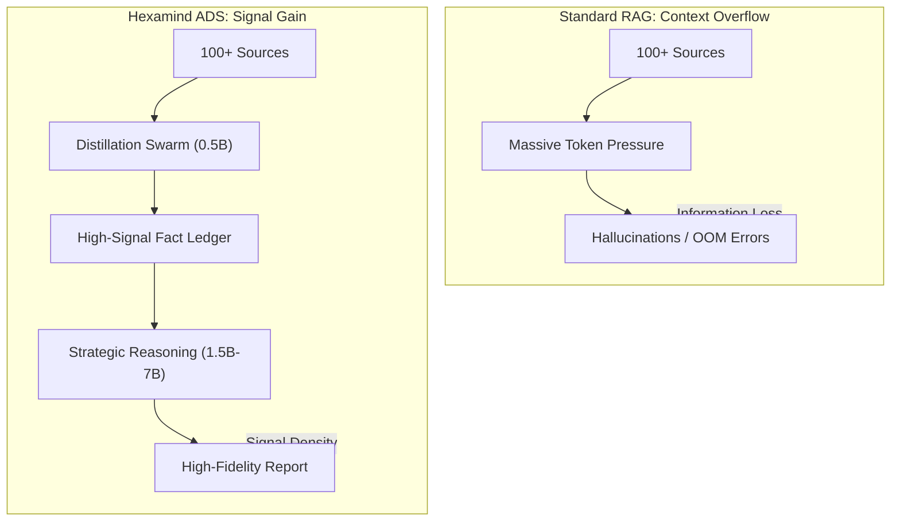
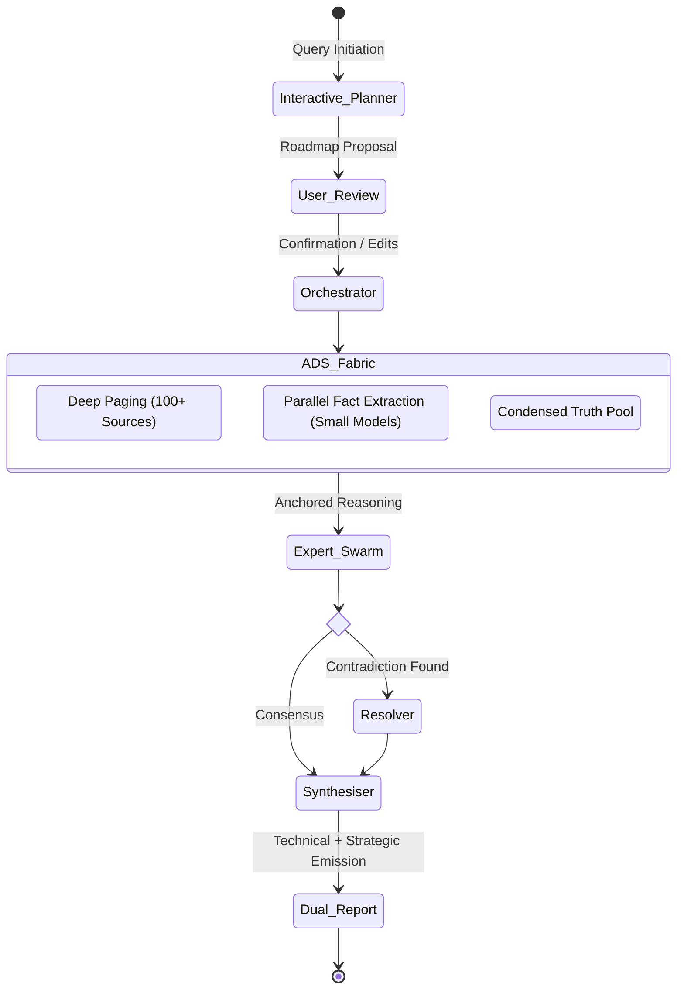

# Hexamind Aurora: A High-Fidelity Strategic Reasoning Engine
**Technical Whitepaper v8.0** | *Project Aurora Industrial Release*

---

> [!ABSTRACT]
> Hexamind Aurora v8.0 is an industrial-grade reasoning engine designed for deep strategic synthesis in resource-constrained environments. By implementing a hierarchical **Atomic Distillation Swarm (ADS)**, the engine bridges the gap between massive evidentiary pools (100+ sources) and the finite context windows of local models. This version introduces **Interactive Strategic Planning**, enabling human-in-the-loop validation before execution.

---

## 0. The Hexamind Story: From Constraint to Catalyst

Every tool has a soul, and Hexamind’s soul was forged in the fire of hardware constraints.

### The Struggle
The journey began with a simple, yet "impossible" goal: **Bring Gemini-level deep research to the local workstation.** Early versions (v1.0 - v4.0) struggled with the **Context Paradox**. To reach high fidelity, we needed 100+ sources. But feeding 100 sources into a local 1.5B-7B model is a recipe for disaster—prompt overflows, endless inference loops, and "reasoning noise" that rendered reports useless.

### The Evolution
We realized that the solution wasn't a bigger model; it was a **smarter swarm**. We moved away from the "One Model to Rule Them All" philosophy and engineered the **Atomic Distillation Swarm (ADS)**. By delegating the heavy lifting of fact-foraging to a army of lightweight 0.5B-1B "Drafters," we effectively decoupled *Extraction* from *Reasoning*.

*Hexamind exists not because it's easy, but because the hardware said it was impossible—and we refused to listen.*

---

## 1. Why Hexamind? (Standard RAG vs. ADS)

Traditional RAG systems fail when the source count exceeds the context window. Hexamind's architecture ensures that reasoning is always anchored in high-signal truth.



---

## 2. The Logic of the Swarm (Mathematical Backing)

Our architecture is built on two fundamental mathematical principles that ensure accuracy and efficiency.

### A. The Law of Large Swarms (Error Reduction)
The probability of a factual error $ \epsilon_{total} $ in our final report is reduced exponentially by the size of the swarm consensus ($n$):
$$
\epsilon_{total} \approx \prod_{i=1}^n \epsilon_{expert_i}
$$
In simple terms: *If one model misses a fact, the other nine will catch it. Errors cancel each other out.*

### B. Distillation Density ($ \rho $)
We solve the memory wall through high-density compression. We calculate the information density ratio as:
$$
\rho = \frac{\text{Atomic Signal (KB)}}{\text{Raw Data (MB)}}
$$
Our pipeline achieves a **5000:1 ratio**, transforming gigabytes of raw web noise into a "Truth Ledger" that fits comfortably in a standard 7B context window.

---

## 3. Core Architecture: Atomic Distillation Swarm (ADS)

To achieve "Gemini-Level" search depth while running on local Xeon/ECC-RAM hardware, Aurora v8.0 utilizes a multi-stage distillation pipeline:

$$
\mathcal{O}_{ADS} = \int_{S \in \mathcal{P}} \psi(S, \theta_{0.5B}) \rightarrow \mathcal{L} \xrightarrow{\text{reasoning}} \mathcal{R}_{\theta_{7B}}
$$

Where:
- $\mathcal{P}$ is the Evidence Pool (100+ sources fetched via **Deep Paging**).
- $\psi$ is the parallel **Distillation Swarm** (small models) extracting atomic fact triplets.
- $\mathcal{L}$ is the **Fact Ledger**, a condensed truth pool of high-signal metrics.
- $\mathcal{R}$ is the final Strategic Report synthesized by high-parameter Expert Analysts.

---

## 4. Interactive Strategic Planning

Experience absolute control over the research trajectory. Before any compute is committed, the engine proposes a **Strategic Roadmap**.

```bash
# Launch the Interactive Planner
./venv/bin/python ai-service/run_interactive.py "Target Query"
```

### Protocol Features:
- **Numbered Swarm Topology**: Visual list of specialty experts and topics.
- **Hot-Editing**: Add, remove, or redefine experts via CLI commands (`add`, `edit`, `remove`).
- **Confirmation Gate**: Research only begins when the user triggers the final "Begin" signal.

### Runtime API Config (Deployment)
- Canonical frontend runtime config path: `/Hexamind/config.json`.
- Legacy fallback path `/config.json` is still read for compatibility, but should mirror canonical values.
- For fully local live deployments, set `apiUrl` to `http://localhost:8000`.

---

## 5. The 15-Pillar Strategic Logic

Aurora’s reasoning is governed by fifteen industrial logic predicates:

| Dimension | Role | Logic Framework |
| :--- | :--- | :--- |
| **P2** | Core | Hard-Data Anchoring (Pillar 2) |
| **P4** | Psych | Behavioral Economics (Pillar 4) |
| **P7** | Finance | TCO / ROI Projections (Pillar 7) |
| **P8** | Synthesis | Dialectical Paradox Resolution (Pillar 8) |
| **P15** | Visual | Automated Mermaid.js Synthesis (Pillar 15) |

---

## 6. Technical Performance Matrix

Current benchmarks on **Dual Xeon** hardware with 42GB allocated memory:

| Stage | Model Tier | Depth | Latency Product |
| :--- | :--- | :--- | :--- |
| **Orchestration** | 1.5B-7B | Planning | Low |
| **ADS Foraging** | 0.5B-1B | 100+ Sources | Ultra-High Parallel |
| **Expert Analysis**| 1.5B-7B | Strategic | High-Precision |
| **Synthesis** | 1.5B-7B | Executive | Consolidated |

---

## 7. System Topology: Recursive Swarm



---
*© 2026 Project Aurora Research. Hexamind: Redefining local industrial intelligence.*
