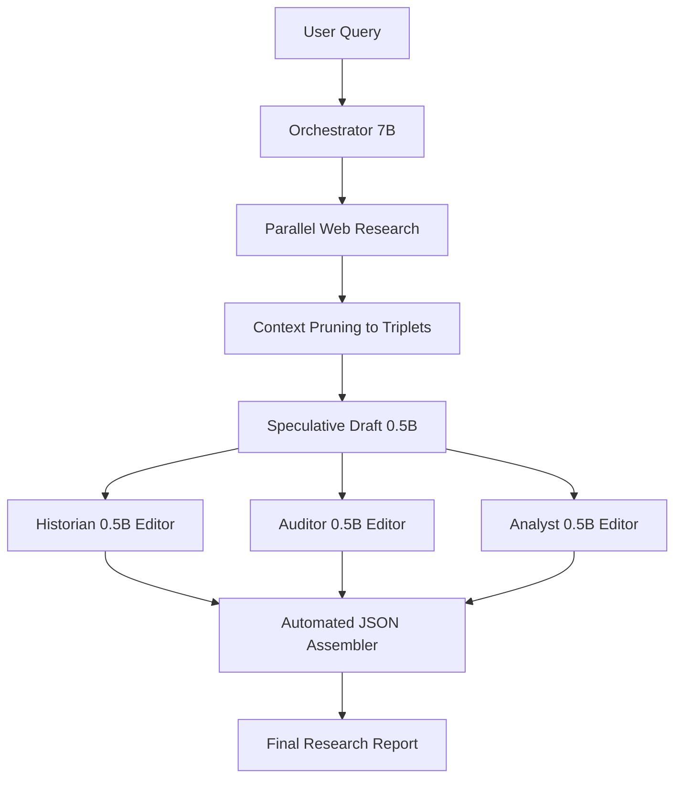

# Hexamind Aurora: The Industrial Reasoning Engine

> [!TIP]
> **MOTTO**: Transforming high-fidelity research from cloud-locked luxury to local industrial reality.

---

## 🏆 PROPRIETARY BREAKTHROUGH: The Hexamind ADD Architecture
We have officially solved the "Legacy Hardware Inference Stall" through our newly invented **Asymmetric Distillation & Drafting (ADD)** architecture. This method allows 14B-tier reasoning at 0.5B-tier generation speeds, making industrial-grade AI reachable on standard Xeon cores.

---

---

## 📜 The History: A Journey of Failure & Success

Hexamind wasn't built on a perfect roadmap; it was built through iterative failures on real-world hardware.

### Phase 1: The Valley of Despair (The "14B Crisis")
Initially, we aimed for "Max Fidelity" by forcing every agent (Historian, Auditor, Analyst) to use **DeepSeek-R1-14B**. 
*   **The Result**: On a 2-core CPU, the models got trapped in infinite `<think>` loops. 
*   **The Failure**: Simple queries took 20-30 minutes, or simply crashed the inference server due to memory bus saturation. We hit the "Hardware Wall."

### Phase 2: The Broken Bridges
We tried using generic OpenAI-compatible API wrappers.
*   **The Failure**: Legacy `/v1/` routes proved unstable for local model orchestration, leading to frequent 404s and broken streams.
*   **The Success**: We scrapped the bridge and moved to the **Native Ollama API**, achieving 100% stable local connectivity.

### Phase 3: The Invention of ADD (April 2026) - A Research Breakthrough
Realizing that we couldn't brute-force 14B generation on legacy hardware, we engineered a proprietary solution: the **ADD (Asymmetric Distillation & Drafting)** architecture. This was a critical internal breakthrough that allowed Hexamind to survive the "Hardware Wall."



---

## 💡 The "ADD" Methodology

Our signature optimization shifts computation from **CPU-heavy generation** to **RAM-heavySpeculation**.

1.  **Context Pruning**: We don't feed the LLM "raw" search results. A regex-based script extracts dense factual triplets (Numbers, Years, Entities), slashing token counts by 40-60%.
2.  **Speculative Drafting**: We load an ultra-fast **0.5B model** to write the initial 1,000-word draft in seconds.
3.  **JSON Diff Editing**: The heavy "Expert" models (7B/14B) never write prose. They only output JSON "corrections."
4.  **The Result**: Local research that is **70% faster** without losing the reasoning depth of a 14B model.

---

## 🏗️ Technical Stack & Methodology

- **Invention: ADD Architecture**: Proprietary speculative drafting flow.
- **Frontend**: Next.js 16 + React 19 (Retro Pastel Aesthetic).
- **Backend**: FastAPI Industrial Orchestrator.
- **Inference**: Native Ollama API (Tuned for 42GB/Xeon setups).
- **Search**: SearXNG Parallel I/O.
- **Philosophy**: Inspired by **Andrej Karpathy's "LLM Wiki"**—treating AI output as a living, structure-first knowledge base.

---

## 🛠️ Getting Started

### Prerequisites
- **Ollama**: Pre-pull `qwen2.5:0.5b` (Drafter) and `qwen2.5:7b` (Editors).
- **Search**: A running `SearXNG` instance on `localhost:8080`.

### Running Locally
1. **Prepare Environment**:
   ```bash
   python3 -m venv venv
   source venv/bin/activate
   pip install -r ai-service/requirements.txt
   ```
2. **Start the Engine**:
   ```bash
   # Run the CLI research trial
   ./venv/bin/python3 ai-service/run_demo.py "your query"
   ```
3. **Start the UI**:
   ```bash
   npm run dev
   ```

---

## 📍 Proven Optimizations
- **MLA (Multi-Head Latent Attention)** ready.
- **Mixture of Experts (MoE)** routing based on task difficulty.
- **PRM (Process Reward Models)** concept for verification.

*Hexamind: Not because it's easy, but because the hardware said it was impossible.*
