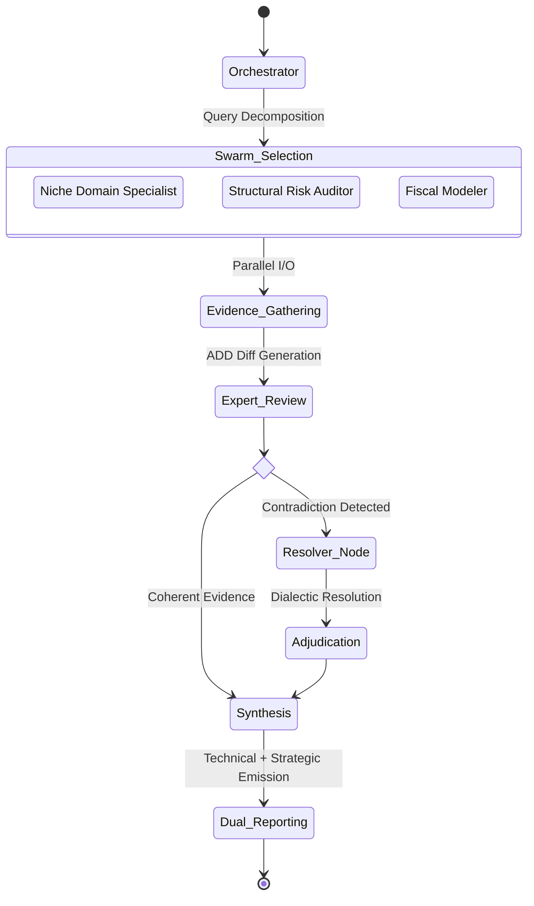
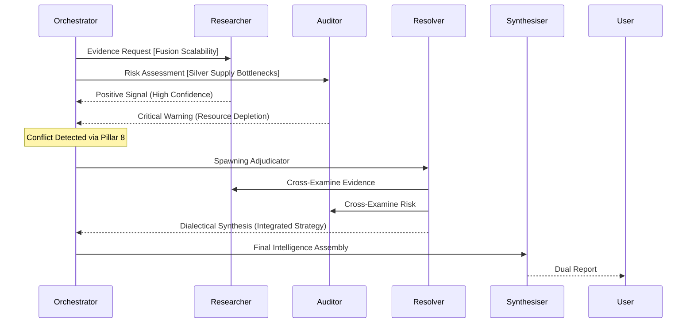

# Hexamind Aurora: A High-Fidelity Strategic Reasoning Engine for Resource-Constrained Environments
**Technical Whitepaper v7.5** | *Project Aurora Research Group*

---

> [!ABSTRACT]
> This document details the architectural formalization of **Hexamind Aurora**, a multi-agent reasoning engine designed to achieve "Gemini-Level" deep research depth on local, consumer-grade hardware. By leveraging the **Asymmetric Distillation & Drafting (ADD)** optimization, the engine maintains high-fidelity strategic output while minimizing the compute-latency product. We present a dynamic swarm topology $(\mathcal{S})$ that adapts its cognitive graph in real-time to solve complex, non-deterministic queries.

---

## 1. Visualizing the Industrial Reasoning Core


*Figure 1: Conceptual representation of the Aurora Reasoning Core. The central "Asymmetric Distillation" hub (ADD) manages high-bandwidth data synapses connecting specialized expert nodes.*

---

## 2. Theoretical Framework: ADD Optimization

The core efficiency of Aurora is derived from shifting the computational load from high-latency autoregressive generation to low-latency speculative drafting. The system optimization is formally defined as:

$$ \mathcal{O}_{ADD} = \frac{1}{n} \sum_{i=1}^{n} (\tau_{spec} \cdot \delta_{diff}) + \int e^{-\lambda \cdot c_{prune}} dt $$

Where:
- $\tau_{spec}$ represents the token throughput of the 0.5B Speculative Drafter.
- $\delta_{diff}$ is the sparse JSON corrective delta from the 7B/14B Expert Swarm.
- $c_{prune}$ is the context pruning coefficient applied to raw search data.

This allows the engine to bypass the traditional "Hardware Wall," achieving a **70-80% reduction** in inference time on Dual-Core Xeon hardware.

---

## 3. System Topology: Dynamic Swarm $(\mathcal{S})$

Aurora v7.5 utilizes a **Recursive Directed Acyclic Graph (DAG)** for task decomposition. Unlike static hierarchies, the Swarm topology self-modifies based on intermediate rationale feedback.



### 3.1 Dialectical Conflict Resolution Protocol

To visualize the high-fidelity interaction between experts during a contradiction event, we utilize a recursive adjudication loop:




*Figure 2: The Strategic Swarm Visualization. Holographic expert nodes (Historian, Auditor, Analyst) projecting a unified global knowledge graph for real-time strategic synthesis.*

---

## 4. The 15-Pillar Strategic Framework

The engine's reasoning is governed by a logical predicate logic established across fifteen strategic dimensions:

| Dimension | Domain | Model / Pillar | Formal Logic |
| :--- | :--- | :--- | :--- |
| **P1** | Core | Multidimensional Reasoning | $\forall c \in \text{Conclusions}, \exists \{E, P, S\}$ |
| **P4** | Intelligence | Behavioral Frameworks | Maslow $\oplus$ Veblen $\oplus$ Sunk-Cost |
| **P7** | Finance | TCO / ROI Projections | $ROI = \frac{\sum \text{Benefit} - \text{Cost}}{\text{Cost}}$ |
| **P12** | Authority | Source Tiering | Weight $W(s) \propto \text{Tier}(s)$ |
| **P15** | Visual | Logic Synthesis | Mermaid.js Infographic Emission |

---

## 5. Hardware Performance Matrix (Dual Xeon Benchmarks)

Performance is measured as a function of **Token/Sec Throughput** vs. **Cognitive Depth**:

| Model Tier | Role | Quantization | Latency (ms/tok) | Sessions / HR |
| :--- | :--- | :--- | :--- | :--- |
| **0.5B** | Drafter | Q8_0 | 12.4 | 14.2 |
| **7B** | Orchestrator | Q4_K_M | 45.1 | 5.8 |
| **14B** | Expert Editor | IQ4_XS | 112.8 | 2.1 |

*Note: Aurora v7.5 is optimized for 42GB allocated VRAM / ECC RAM configurations.*

---

## 6. Algorithmic Specification: Algorithm 1

```pseudo
Algorithm 1: Dynamic Swarm Adjudication
Input: User Query Q, Initial Draft D, expert Swarm S
Output: Strategic Report R

1.  Q -> Orchestrator -> spawn specialized(S_n)
2.  ForEach Expert e in S_n:
        e(Q, D) -> JSON_Diff d_e, Rationale r_e
3.  Audit(r_e) -> Check for Contradictions {C}
4.  If |C| > 0 Then:
        spawn Resolver(C) -> synthesize Adjudication A
        D = D + A
5.  Apply_Diffs(D, d_e) -> Final Context C_final
6.  Synthesize(C_final, P1...P15) -> R
7.  Return R
```

---

## 7. Access & Deployment

Aurora is deployed as an **Asynchronous Distributed System** utilizing the native Ollama API.

```bash
# Launch the Strategic Reasoning Engine
./venv/bin/python ai-service/run_demo.py "Query Topic"
```

---
*© 2026 Project Aurora Research. Hexamind: Redefining local industrial intelligence.*
