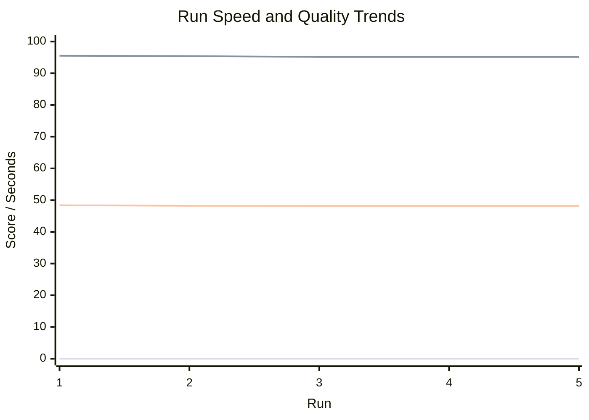
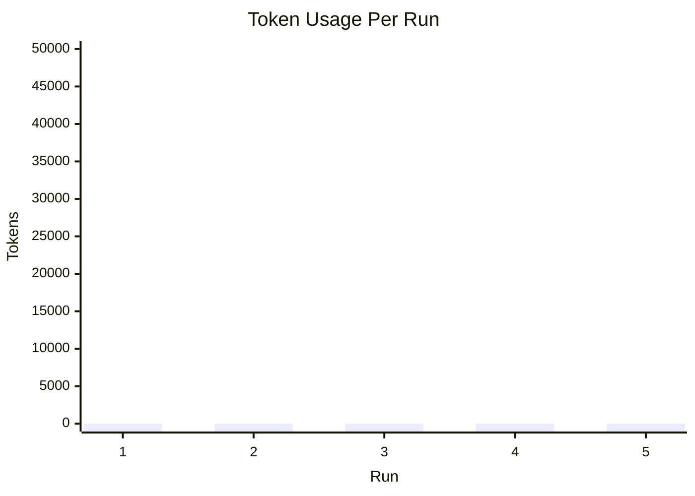

# Autonomous Run Results Dashboard

Auto-updated after each autonomous run.

Latest iteration: iter-001-2026-04-04T08-08-12-d5ea97a8
Latest provider: local-unavailable
API present: yes

## Trend Charts

## Run Table

| Run | Iteration | Provider | API | Speed(s) | Accuracy* | Human-like* | Usefulness* | Human Review | Tokens | Overall | Trust |
| --- | --- | --- | --- | ---: | ---: | ---: | ---: | ---: | ---: | ---: | ---: |
| 1 | iter-001-2026-04-04T07-40-15-4d0ba2d0 | local-unavailable | yes | 187.48 | 0.00 | 95.51 | 48.39 | pending | 0 | 70.00 | 0.00 |
| 2 | iter-001-2026-04-04T07-46-39-00600704 | local-unavailable | yes | 238.47 | 0.00 | 95.42 | 48.20 | pending | 0 | 70.00 | 0.00 |
| 3 | iter-001-2026-04-04T07-55-49-a0c898b9 | local-unavailable | yes | 237.45 | 0.00 | 95.12 | 48.17 | pending | 0 | 70.00 | 0.00 |
| 4 | iter-001-2026-04-04T08-00-57-fb1e3d64 | local-unavailable | yes | 236.94 | 0.00 | 95.12 | 48.17 | pending | 0 | 70.00 | 0.00 |
| 5 | iter-001-2026-04-04T08-08-12-d5ea97a8 | local-unavailable | yes | 236.70 | 0.00 | 95.12 | 48.17 | pending | 0 | 70.00 | 0.00 |

*Accuracy, Human-like, and Usefulness are proxy metrics for continuous comparison.
*Human Review is a manual score from the per-run review form (0.00/pending means not yet filled).