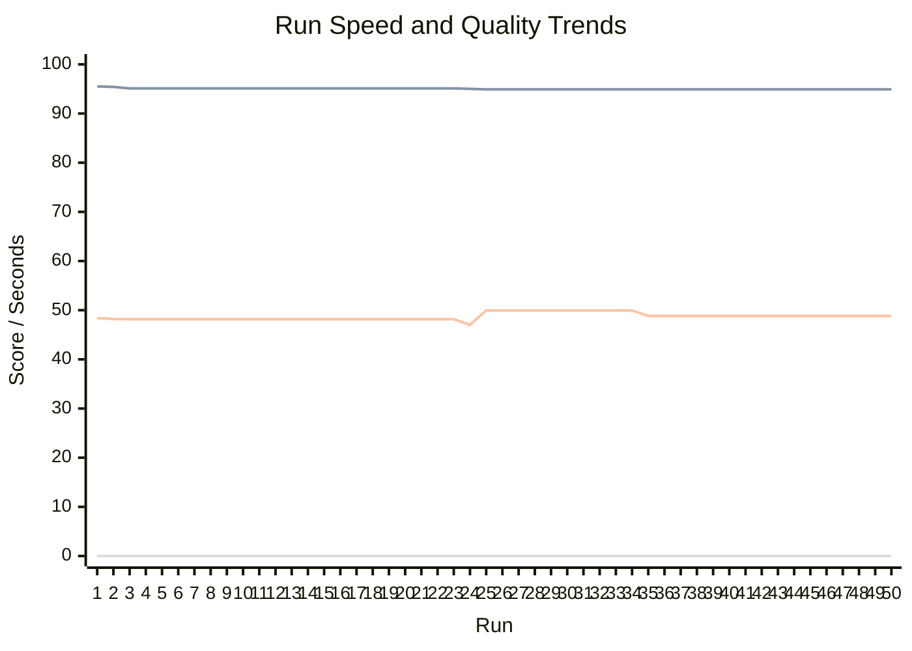
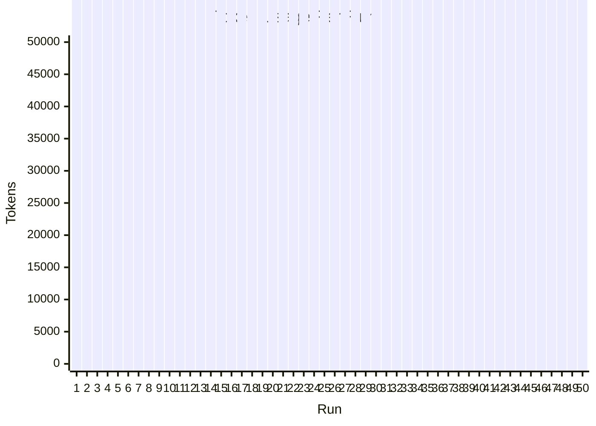

# Autonomous Run Results Dashboard

Auto-updated after each autonomous run.

Latest iteration: iter-001-2026-04-04T11-24-06-97b47b48
Latest provider: local-unavailable
API present: yes

## Trend Charts

## Run Table

| Run | Iteration | Provider | API | Speed(s) | Accuracy* | Human-like* | Usefulness* | Human Review | Tokens | Overall | Trust |
| --- | --- | --- | --- | ---: | ---: | ---: | ---: | ---: | ---: | ---: | ---: |
| 1 | iter-001-2026-04-04T07-40-15-4d0ba2d0 | local-unavailable | yes | 187.48 | 0.00 | 95.51 | 48.39 | pending | 74143 | 70.00 | 0.00 |
| 2 | iter-001-2026-04-04T07-46-39-00600704 | local-unavailable | yes | 238.47 | 0.00 | 95.42 | 48.20 | pending | 93302 | 70.00 | 0.00 |
| 3 | iter-001-2026-04-04T07-55-49-a0c898b9 | local-unavailable | yes | 237.45 | 0.00 | 95.12 | 48.17 | pending | 93304 | 70.00 | 0.00 |
| 4 | iter-001-2026-04-04T08-00-57-fb1e3d64 | local-unavailable | yes | 236.94 | 0.00 | 95.12 | 48.17 | pending | 93304 | 70.00 | 0.00 |
| 5 | iter-001-2026-04-04T08-08-12-d5ea97a8 | local-unavailable | yes | 236.70 | 0.00 | 95.12 | 48.17 | pending | 93304 | 70.00 | 0.00 |
| 6 | iter-001-2026-04-04T08-12-12-4cfa68e5 | local-unavailable | yes | 236.62 | 0.00 | 95.12 | 48.17 | pending | 93304 | 70.00 | 0.00 |
| 7 | iter-001-2026-04-04T08-16-12-f43afa37 | local-unavailable | yes | 236.35 | 0.00 | 95.12 | 48.17 | pending | 93304 | 70.00 | 0.00 |
| 8 | iter-001-2026-04-04T08-20-12-a9bbe589 | local-unavailable | yes | 236.35 | 0.00 | 95.12 | 48.17 | pending | 93304 | 70.00 | 0.00 |
| 9 | iter-001-2026-04-04T08-24-12-db2af632 | local-unavailable | yes | 236.43 | 0.00 | 95.12 | 48.17 | pending | 93304 | 70.00 | 0.00 |
| 10 | iter-001-2026-04-04T08-28-12-a466cb23 | local-unavailable | yes | 236.48 | 0.00 | 95.12 | 48.17 | pending | 93304 | 70.00 | 0.00 |
| 11 | iter-001-2026-04-04T08-32-12-8527953f | local-unavailable | yes | 236.36 | 0.00 | 95.12 | 48.17 | pending | 93304 | 70.00 | 0.00 |
| 12 | iter-001-2026-04-04T08-36-13-2dbceeb7 | local-unavailable | yes | 236.37 | 0.00 | 95.12 | 48.17 | pending | 93304 | 70.00 | 0.00 |
| 13 | iter-001-2026-04-04T08-40-13-47de5cac | local-unavailable | yes | 236.38 | 0.00 | 95.12 | 48.17 | pending | 93304 | 70.00 | 0.00 |
| 14 | iter-001-2026-04-04T08-47-11-29ed2a1a | local-unavailable | yes | 236.58 | 0.00 | 95.12 | 48.17 | pending | 93304 | 70.00 | 0.00 |
| 15 | iter-001-2026-04-04T08-51-11-af7023d2 | local-unavailable | yes | 236.46 | 0.00 | 95.12 | 48.17 | pending | 93304 | 70.00 | 0.00 |
| 16 | iter-001-2026-04-04T08-55-11-762cdb61 | local-unavailable | yes | 236.59 | 0.00 | 95.12 | 48.17 | pending | 93304 | 70.00 | 0.00 |
| 17 | iter-001-2026-04-04T08-59-11-ea1794de | local-unavailable | yes | 236.56 | 0.00 | 95.12 | 48.17 | pending | 93304 | 70.00 | 0.00 |
| 18 | iter-001-2026-04-04T09-03-11-14de4d2f | local-unavailable | yes | 236.52 | 0.00 | 95.12 | 48.17 | pending | 93304 | 70.00 | 0.00 |
| 19 | iter-001-2026-04-04T09-07-11-b32c6376 | local-unavailable | yes | 236.52 | 0.00 | 95.12 | 48.17 | pending | 93304 | 70.00 | 0.00 |
| 20 | iter-001-2026-04-04T09-11-11-68291bb5 | local-unavailable | yes | 236.42 | 0.00 | 95.12 | 48.17 | pending | 93304 | 70.00 | 0.00 |
| 21 | iter-001-2026-04-04T09-15-11-be36b271 | local-unavailable | yes | 236.44 | 0.00 | 95.12 | 48.17 | pending | 93304 | 70.00 | 0.00 |
| 22 | iter-001-2026-04-04T09-23-04-f926e086 | local-unavailable | yes | 236.67 | 0.00 | 95.12 | 48.17 | pending | 93304 | 70.00 | 0.00 |
| 23 | iter-001-2026-04-04T09-27-04-caf3a5c0 | local-unavailable | yes | 237.16 | 0.00 | 95.12 | 48.17 | pending | 93304 | 70.00 | 0.00 |
| 24 | iter-001-2026-04-04T09-32-58-d2b06dc9 | local-unavailable | yes | 236.71 | 0.00 | 95.02 | 47.00 | pending | 103301 | 70.00 | 0.00 |
| 25 | iter-001-2026-04-04T09-38-53-a5e9ee25 | local-unavailable | yes | 235.91 | 0.00 | 94.92 | 49.95 | pending | 103301 | 70.00 | 0.00 |
| 26 | iter-001-2026-04-04T09-42-53-ed71848c | local-unavailable | yes | 236.19 | 0.00 | 94.92 | 49.95 | pending | 103301 | 70.00 | 0.00 |
| 27 | iter-001-2026-04-04T09-46-53-3ca2eec1 | local-unavailable | yes | 235.87 | 0.00 | 94.91 | 49.95 | pending | 103301 | 70.00 | 0.00 |
| 28 | iter-001-2026-04-04T09-50-53-a55412e1 | local-unavailable | yes | 235.00 | 0.00 | 94.91 | 49.95 | pending | 103301 | 70.00 | 0.00 |
| 29 | iter-001-2026-04-04T09-54-53-aa4161dd | local-unavailable | yes | 235.01 | 0.00 | 94.91 | 49.95 | pending | 103301 | 70.00 | 0.00 |
| 30 | iter-001-2026-04-04T09-58-55-179023b8 | local-unavailable | yes | 234.94 | 0.00 | 94.91 | 49.95 | pending | 103301 | 70.00 | 0.00 |
| 31 | iter-001-2026-04-04T10-02-55-d5d4d590 | local-unavailable | yes | 234.99 | 0.00 | 94.91 | 49.95 | pending | 103301 | 70.00 | 0.00 |
| 32 | iter-001-2026-04-04T10-06-55-16c5dcc2 | local-unavailable | yes | 235.07 | 0.00 | 94.91 | 49.95 | pending | 103301 | 70.00 | 0.00 |
| 33 | iter-001-2026-04-04T10-10-55-5cd64efe | local-unavailable | yes | 235.17 | 0.00 | 94.91 | 49.95 | pending | 103301 | 70.00 | 0.00 |
| 34 | iter-001-2026-04-04T10-14-55-bdbbfcb9 | local-unavailable | yes | 235.66 | 0.00 | 94.91 | 49.95 | pending | 103301 | 70.00 | 0.00 |
| 35 | iter-001-2026-04-04T10-19-46-e8bb3192 | local-unavailable | yes | 235.28 | 0.00 | 94.91 | 48.83 | pending | 103301 | 70.00 | 0.00 |
| 36 | iter-001-2026-04-04T10-23-46-e57240f7 | local-unavailable | yes | 235.40 | 0.00 | 94.91 | 48.83 | pending | 103301 | 70.00 | 0.00 |
| 37 | iter-001-2026-04-04T10-27-46-7332bb41 | local-unavailable | yes | 235.01 | 0.00 | 94.91 | 48.83 | pending | 103301 | 70.00 | 0.00 |
| 38 | iter-001-2026-04-04T10-31-46-cdda679b | local-unavailable | yes | 235.00 | 0.00 | 94.91 | 48.83 | pending | 103301 | 70.00 | 0.00 |
| 39 | iter-001-2026-04-04T10-35-46-b2c64b6e | local-unavailable | yes | 235.78 | 0.00 | 94.91 | 48.83 | pending | 103301 | 70.00 | 0.00 |
| 40 | iter-001-2026-04-04T10-39-48-b7fc315e | local-unavailable | yes | 235.70 | 0.00 | 94.91 | 48.83 | pending | 103301 | 70.00 | 0.00 |
| 41 | iter-001-2026-04-04T10-46-23-c5f3709a | local-unavailable | yes | 236.28 | 0.00 | 94.91 | 48.83 | pending | 103301 | 70.00 | 0.00 |
| 42 | iter-001-2026-04-04T10-51-03-64db17e7 | local-unavailable | yes | 236.19 | 0.00 | 94.91 | 48.83 | pending | 103301 | 70.00 | 0.00 |
| 43 | iter-001-2026-04-04T10-55-03-63835ffe | local-unavailable | yes | 236.27 | 0.00 | 94.91 | 48.83 | pending | 103301 | 70.00 | 0.00 |
| 44 | iter-001-2026-04-04T10-59-03-83f34648 | local-unavailable | yes | 236.18 | 0.00 | 94.91 | 48.83 | pending | 103301 | 70.00 | 0.00 |
| 45 | iter-001-2026-04-04T11-03-04-7b25b0b8 | local-unavailable | yes | 236.41 | 0.00 | 94.91 | 48.83 | pending | 103301 | 70.00 | 0.00 |
| 46 | iter-001-2026-04-04T11-07-05-e153da42 | local-unavailable | yes | 236.90 | 0.00 | 94.91 | 48.83 | pending | 103301 | 70.00 | 0.00 |
| 47 | iter-001-2026-04-04T11-12-04-5b4c7d2c | local-unavailable | yes | 236.39 | 0.00 | 94.91 | 48.83 | pending | 103301 | 70.00 | 0.00 |
| 48 | iter-001-2026-04-04T11-16-04-fb636b7d | local-unavailable | yes | 236.52 | 0.00 | 94.91 | 48.83 | pending | 103301 | 70.00 | 0.00 |
| 49 | iter-001-2026-04-04T11-20-05-ebd87bc2 | local-unavailable | yes | 236.26 | 0.00 | 94.91 | 48.83 | pending | 103301 | 70.00 | 0.00 |
| 50 | iter-001-2026-04-04T11-24-06-97b47b48 | local-unavailable | yes | 236.57 | 0.00 | 94.91 | 48.83 | pending | 103301 | 70.00 | 0.00 |

*Accuracy, Human-like, and Usefulness are proxy metrics for continuous comparison.
*Human Review is a manual score from the per-run review form (0.00/pending means not yet filled).